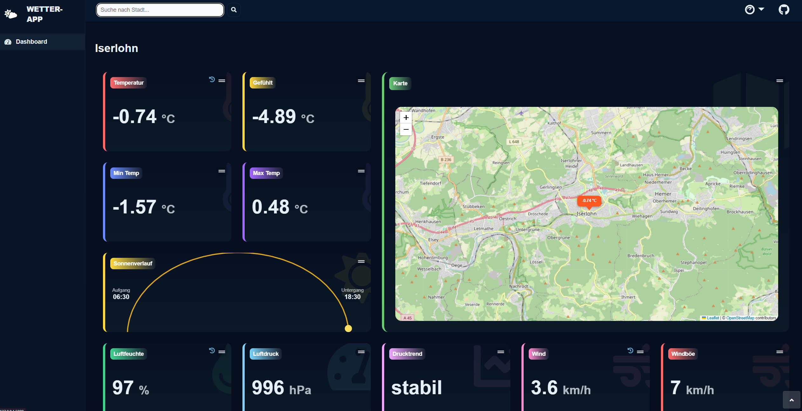

<h1 align="center">🌦️ WetterApp</h1>

<p align="center">
  
  
  
</p>

<p align="center"></p>

<h2 align="center">Ein Gruppenprojekt im Rahmen des Masterstudiums "Angewandte KI"</h1>

<p align="center">
  
</p>

## 📋 Überblick

Die WetterApp ist eine Web-Anwendung, die Wetterdaten visuell ansprechend darstellt:

- **Interaktive Karte** zeigt die aktuelle Stadt mit Temperatur-Pin (`Folium`)
- **Echtzeit-Updates** über WebSockets (``Socket.IO``)
- **Flexible Datenquellen**: CSV-Dateien oder externe APIs (z. B. OpenWeather)
- **Responsives Design** über ``Bootstrap``
- **Modulare Backend-Architektur** für einfache Erweiterungen bei gleichbleibenden Schnittstellen

---

## ✨ Features

### Frontend

- 🗺️ **Live-Karte**:  Zeigt gewählte Stadt mit Temperatur-Marker
- 📊 **Wetter-Widgets**: Temperatur, Luftfeuchtigkeit, Windgeschwindigkeit, Sonnenauf-/-untergang
- 🔄 **WebSocket-Updates**:  Kein Seiten-Neuladen nötig
- 🎨 **Modernes UI**: Bootstrap, responsives Design

### Backend

- 🔌 **Provider-Architektur**: Einfacher Wechsel zwischen CSV und API
- 📝 **Data Normalizer**: Vereinheitlicht Daten aus verschiedenen Quellen -> stets gleiches Format ans Frontend
- 🛡️ **Robuste Fehlerbehandlung**: Validierung, Logging, Fallbacks
- 🗂️ **Saubere Struktur**: Getrennte Layer (Provider, Services, Dashboard)

## 🛠️ Installation & Verwendung

### Voraussetzungen
- Python 3.9+
- pip

```bash
# Repository klonen
git clone https://github.com/julwilke/WetterApp.git
```

```bash
# Virtuelle Umgebung erstellen
python -m venv venv

# Windows
venv\Scripts\activate
# macOS/Linux
source venv/bin/activate
```

```bash
# Dependencies installieren
pip install -r requirements.txt
```

```bash
# Umgebungsvariablen konfigurieren
# Erstelle eine .env (oder bennene .env.example um) mit folgendem Inhalt:

# Welcher Provider? ('api' oder 'csv') # TODO: API fehlt noch
WEATHER_PROVIDER = csv
OPENWEATHER_API_KEY = dein_key_hier
```

```bash
# Dashboard starten
python app.py

(läuft dann unter: http://127.0.0.1:5000)
```

### Alternative: CLI-Version mit API der WetterApp

```bash
# CLI-Version starten
python weather_cli.py 
```

# 🏗 Architekturüberblick

```text
WetterApp/
├── app.py                              # Einstiegspunkt der Anwendung
├── .env                                # Konfiguration (nicht im Repo)
├── requirements.txt                    # Python-Abhängigkeiten
│
├── backend/
│   ├── dashboard.py                    # Flask + Socket.IO Backend
│   ├── logging_config.py               # Zentrale Logging-Konfiguration
│   │
│   ├── provider/
│   │   ├── csv_weather_provider.py     # CSV-Datenquelle
│   │   └── api_weather_provider. py     # API-Gerüst (OpenWeather)
│   │
│   └── services/
│       ├── data_normalizer.py          # Daten-Normalisierung
│       └── generate_map. py             # Folium-Karten-Generator
│
├── weather_dashboard/
│   ├── templates/
│   │   └── index.html                  # Frontend HTML
│   │
│   └── static/
│       ├── styles.css                  # Styling
│       ├── script.js                   # Frontend-Logik (WebSocket, UI-Updates)
│       └── map/                        # Generierte Karten (dynamisch)
│
└── data/
    └── samples/
        └── weather_sample.csv          # Beispiel-Wetterdaten
```


# 🛠️ Technology Stack

### Backend (Python)

| Package | Version | Verwendung |
|---------|---------|------------|
| **Flask** | 3.1.2 | Web-Framework für HTTP-Routen und Template-Rendering |
| **Flask-SocketIO** | 5.5.1 | WebSocket-Unterstützung für Echtzeit-Updates |
| **Pandas** | 2.3.3 | CSV-Datenverarbeitung und Filterung |
| **Folium** | 0.20.0 | Generierung interaktiver Leaflet-Karten |
| **Geopy** | 2.4.1 | Geocoding (Stadtname → GPS-Koordinaten) |
| **python-dotenv** | 1.2.1 | Laden von Umgebungsvariablen aus `.env` |
| **requests** | 2.32.5 | HTTP-Client für API-Calls (API-Provider vorbereitet) |

### Frontend

| Technologie | Version | Verwendung |
|-------------|---------|------------|
| **HTML5** | - | Markup und Struktur |
| **CSS3** | - | Styling und Layout |
| **JavaScript (ES6+)** | - | Client-seitige Logik und DOM-Manipulation |
| **Bootstrap** | 5.3 | Responsive UI-Framework (Grid, Components) |
| **Socket.IO Client** | 4.5 | WebSocket-Kommunikation mit Backend |
| **Leaflet** | 1.9 (via Folium) | Interaktive Kartenvisualisierung |

### Entwicklung & Tools

- **Python** 3.9+
- **pip** für Dependency-Management
- **Virtual Environment** (venv) für isolierte Umgebung

----

## 👥 Team

### PKI- Projektgruppe B1-3

- Adham
- Tugba
- Nick-Andre
- Julian

## 📄 License

AGPLv3 — see LICENSE file for full terms.
© 2025 (PKI Gruppe B1-3)

---

**Letzte Aktualisierung**: 12.12.2025 by Julian
